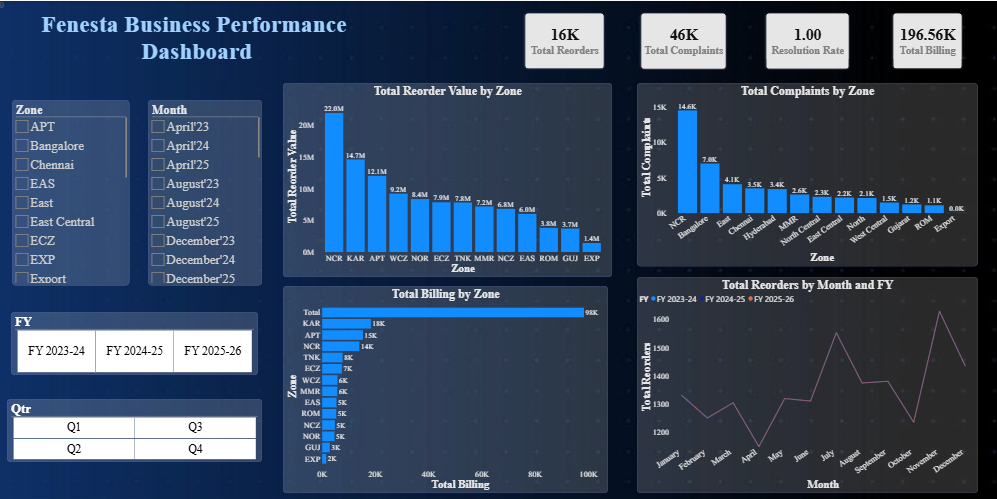
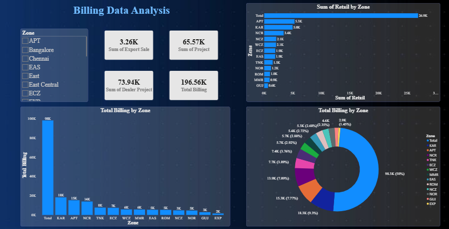
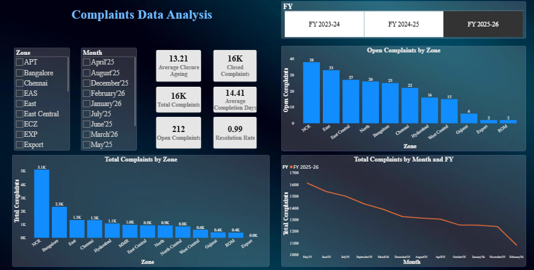

# 📊 Fenesta Service Performance Dashboard (Power BI)

## Overview

This project presents an interactive Power BI dashboard developed to analyze Fenesta's service performance using real business data.

The dashboard helps monitor complaints, billing performance, response times, and service trends through interactive visualizations.

## Dashboard Pages

### 🏠 Home

- Navigation panel
- KPI overview
- Dashboard summary

### 📈 Service Analysis

- Monthly complaint trend
- Zone-wise complaints
- Response time analysis
- Complaint status

### 💰 Billing Analysis

- Total billing
- Zone-wise billing percentage
- Monthly billing trend
- Billing comparison

### 🛠 Complaint Analysis

- Complaint categories
- Product-wise complaints
- Root cause analysis
- Resolution insights

## Tools Used

- Power BI
- Power Query
- DAX
- Microsoft Excel

## Key Features

- Interactive slicers
- Drill-through reports
- Dynamic KPIs
- Clean and responsive dashboard
- Business-focused visualizations

## Demo Video

